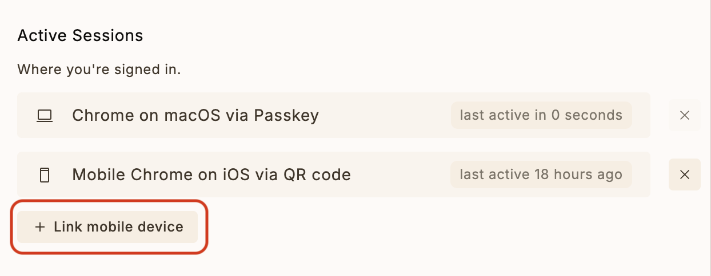
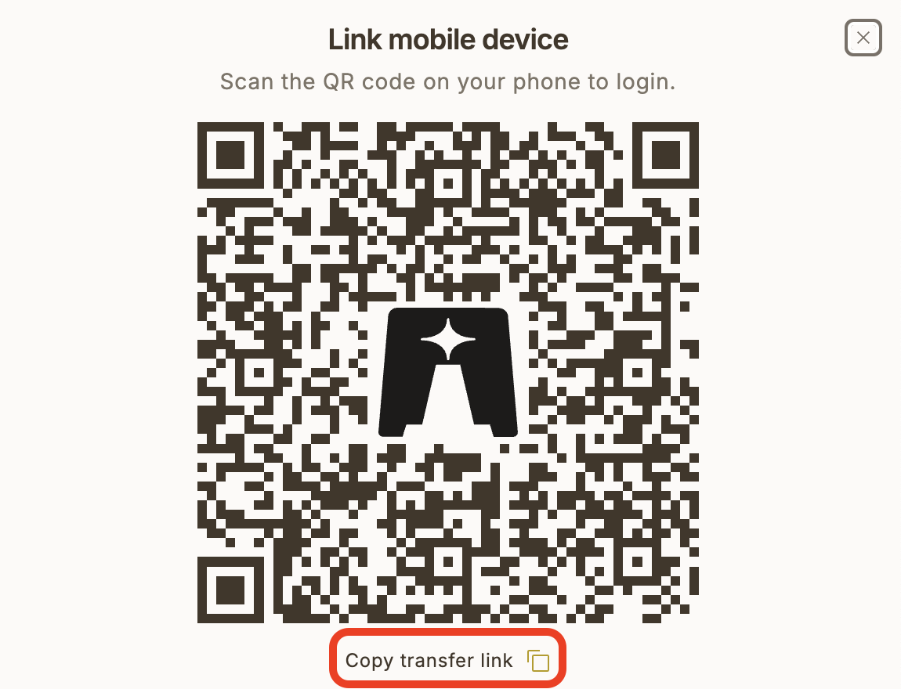

# Lighthouse MCP

A Model Context Protocol (MCP) server that enables Claude to interact with your Lighthouse.one portfolio data. This integration allows you to query and analyze your crypto portfolio directly through Claude.

## Features

- **Authentication**: Securely authenticate with Lighthouse using transfer token URLs
- **Portfolio Overview**: Get detailed breakdowns of your portfolio including:
  - Total portfolio value
  - Asset type distribution
  - Major holdings (≥ $1,000)
  - List of connected wallets/accounts
- **Asset Details**: View detailed information about specific assets in your portfolio
- **Transaction History**: Access your transaction history across wallets
- **Performance Analysis**: Get insights on portfolio performance over time

You can ask Claude any form of natural language questions about performance, assets distribution etc and it will try its best to invoke the right tools and generate an asnwer for you.

## Usage with Claude Desktop

> NOTE: You **must** have at least Node LTS installed to use this MCP server. Try [N-Install](https://github.com/mklement0/n-install) to quickly install Node on your system.

Add this to your `claude_desktop_config.json`:

```json
{
  "mcpServers": {
    "lighthouse": {
      "command": "npx",
      "args": ["-y", "mcp-lighthouse"]
    }
  }
}
```

Then restart the Claude app. If you don't get any errors on startup, then the MCP server is working.

## Authentication Walkthrough

You'll be asked for the authentication URL. To get it, follow these steps:

1. Go to the Settings page on Lighthouse.one
2. Click on "Link Mobile Device" option



3. Click on "Copy transfer link"



Note: The URL will be in the format of a Lighthouse transfer token URL which Claude can use to authenticate your session.

## Available Commands

Once connected, you can use the following commands with Claude:

1. **Authenticate**

   ```
   Use the authenticate command with a Lighthouse transfer token URL to log in.
   ```

2. **List Portfolios**

   ```
   Use the listLighthousePortfolios command to see all your portfolios and their total values.
   ```

3. **Get Portfolio Overview**

   ```
   Use the getLighthousePortfolio command to view your current portfolio status with detailed breakdowns.
   ```

4. **Get Yield Data**

   ```
   Use the getLighthouseYieldData command to see yield information for your portfolio.
   ```

5. **Get Performance Data**
   ```
   Use the getLighthousePerformanceData command to analyze your portfolio's performance over time.
   ```

## Session Management

- The server maintains a session file (`.lighthouse_session`) to persist your authentication
- You only need to authenticate once unless you explicitly log out or the session expires
- Session data is stored securely on your local machine

> NOTE: You can always revoke the session key from the Lighthouse dashboard.

## Security Note

This MCP server runs locally on your machine and communicates directly with Lighthouse's API. Your authentication credentials are never shared with Claude or any third-party services.

## Running Locally

1. Build the project:

```bash
npm install

npm run build
```

2. Add the MCP server to Claude

Paste this JSON into the Develop settings of the Claude app. Make sure to point to the correct build output.

```json
{
  "mcpServers": {
    "lighthouse": {
      "command": "path/to/node/installation",
      "args": ["path/to/this/folder/mcp-lighthouse/dist/index.js"]
    }
  }
}
```

## Development

The project is built with TypeScript and uses the FastMCP framework for MCP server implementation. To modify or extend the functionality:

1. Make changes to `index.ts`
2. Rebuild the project: `npm run build`
3. Restart the server

## Requirements

- Node.js 16 or higher
- npm or yarn
- A Lighthouse.one account
